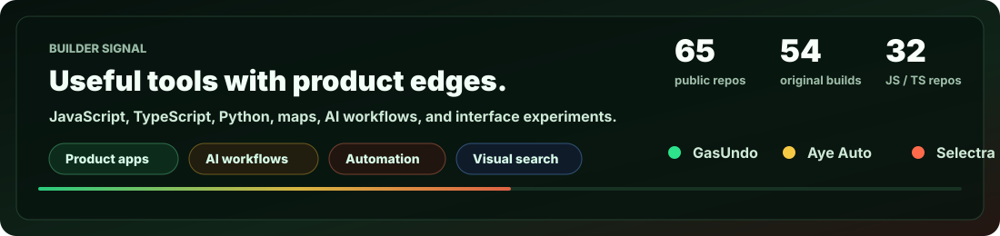

<p align="center">
  
</p>

<h1 align="center">Vaishakh Suresh</h1>

<p align="center">
  <strong>I build small, useful things until they start feeling inevitable.</strong>
  <br />
  Product-minded full-stack work, AI-assisted workflows, developer tools, dashboards, and the occasional beautifully unnecessary experiment.
</p>

<p align="center">
  <a href="https://github.com/vaishakh3/noiceboard">Noiceboard</a>
  ·
  <a href="https://github.com/vaishakh3/selectra">Selectra</a>
  ·
  <a href="https://github.com/vaishakh3/domqa">DOM QA</a>
  ·
  <a href="https://github.com/vaishakh3/emomusic">Emomusic</a>
</p>

<p align="center">
  
</p>

## Current Loop

I like work that sits between **product polish** and **systems thinking**: interfaces that make messy workflows feel calm, automation that removes tiny daily frictions, and experiments that are playful enough to remember.

- Building with JavaScript, TypeScript, Python, CSS, Node, React, and GitHub Actions.
- Exploring AI-assisted product flows, browser QA, interview intelligence, profile surfaces, and visual search ideas.
- Keeping a bias toward shipping: small first, useful next, polished right after.

## Selected Builds

| Project | Signal |
| --- | --- |
| [Noiceboard](https://github.com/vaishakh3/noiceboard) | An embeddable GitHub profile dashboard with generated SVG and refresh automation. |
| [Selectra](https://github.com/vaishakh3/selectra) | Adaptive Interview Engine, multi-tenant interview intelligence. |
| [DOM QA](https://github.com/vaishakh3/domqa) | Browser-facing QA experiments for checking interface behavior. |
| [Emomusic](https://github.com/vaishakh3/emomusic) | Emotion-based music player. |
| [Shazzam Outfits](https://github.com/vaishakh3/shazzam-outfits) | Visual-search-flavored outfit experiment. |
| [Teleprompter](https://github.com/vaishakh3/teleprompter) | A focused utility surface for speaking, recording, and presenting. |

## Operating Notes

```ts
const vaishakh = {
  mode: "ship the useful thing",
  taste: ["quiet interfaces", "sharp automation", "good names"],
  stack: ["typescript", "javascript", "python", "css"],
  currentQuestion: "How do we make this simpler without making it smaller?"
};
```

## Find Me Here

The best map of what I am thinking through is usually the latest commit history. Start with the pinned repositories, then follow the weird names.
